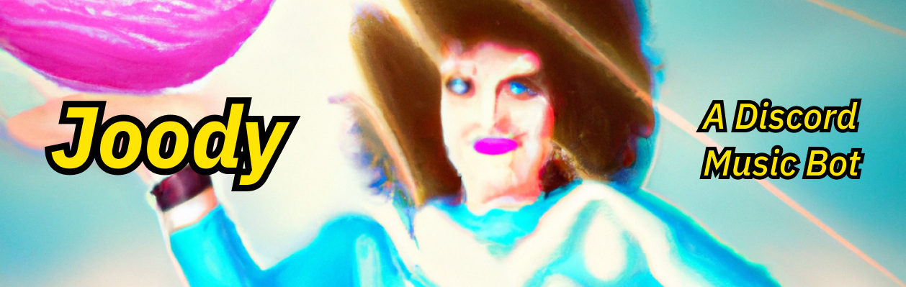

# Joody: A Discord Music Bot

## Table of Contents

- [General Info](#general-information)
- [Technologies Used](#technologies-used)
- [Features](#features)
- [Project Status](#project-status)
- [Issues](#issues)
- [To Do](#to-do)
- [Acknowledgements](#acknowledgements)

## General Information

Based on [@3chospirits](https://github.com/3chospirits) Discord music bot [tutorial](https://www.youtube.com/watch?v=fN29HIaoHLU&ab_channel=Niconiconii). I wanted to create a music bot with simple functionality for a private server that could fit the needs of those in it, all without using an established bot.

The bot functions as intended with some room for improvement in the next version.

## Technologies Used

- Discord.js v14.7.1
- Discord-Player v5.3.2
- Node v18+

## Features

Audio streaming from Youtube in a private Discord channel

## Project Status

Version 1: _complete as of 12/15/22_ 

Version 2: _not started_

## Issues

None currently

## To Do
| Task | Status |
|---|---|
| Add to main Discord server | :white_check_mark: |
| Deploy to 24/7 VPS | :x: |
| Fix queueing bug | :white_check_mark: |

## Acknowledgements

Credit to [@3chospirits](https://github.com/3chospirits) for the [tutorial](https://www.youtube.com/watch?v=fN29HIaoHLU&ab_channel=Niconiconii) on how to scaffold the basics with this bot and to [@Codseus](https://github.com/Codseus) for the updated PR with Guild actions for v14 of the Discord API

